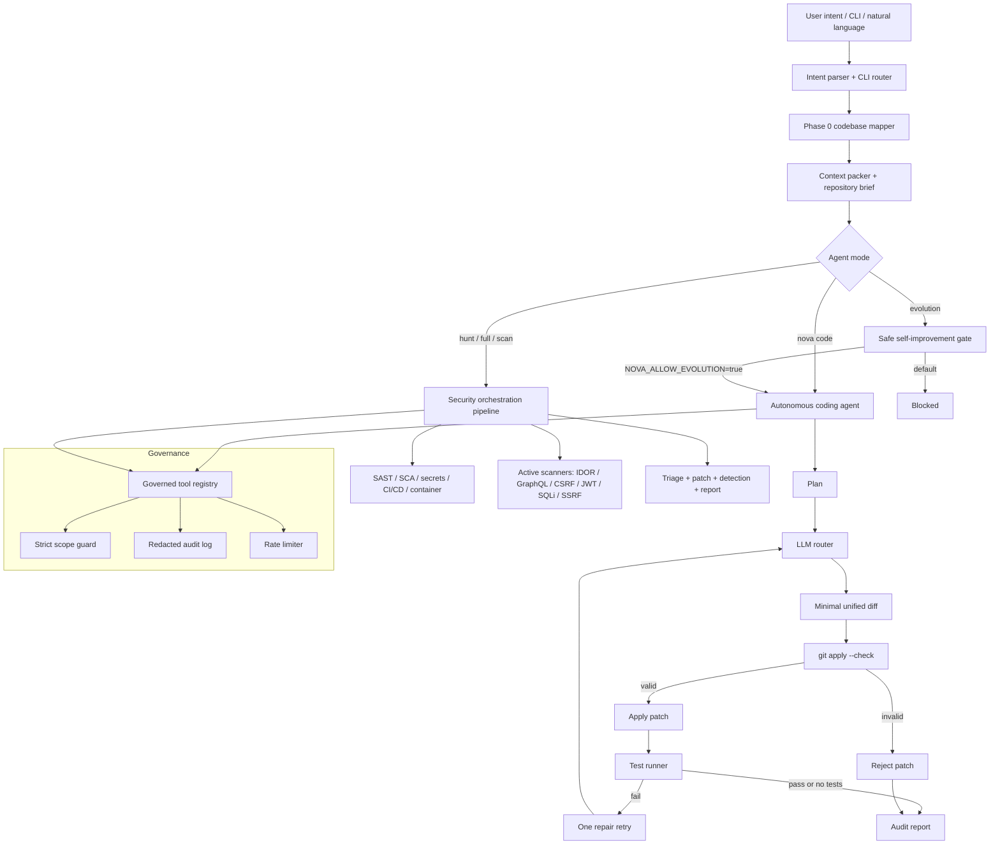

# 🦅 Nova Arsenal v4.2

> **The most capable open-source autonomous security research agent.**
> 
> Reads your entire codebase in seconds, maps every language and framework strategically, connects all 35+ modules together, and hunts vulnerabilities with the intelligence of a senior penetration tester.

**Status:** ✅ Production-Ready | 🦅 35+ Modules | 🤖 Multi-Agent LLM | 🚀 Cloud-Native


## Nova Autonomous Agent Runtime

Nova Arsenal now ships as an **autonomous coding and security agent runtime**. The
security modules remain available, but the core agent loop has been upgraded to
support repository mapping, governed tool execution, autonomous patch planning,
validated diff application, test execution, retry-on-failure, and auditable run
reports.

### What changed in this release

- `nova code` runs a conservative autonomous coding loop: map the repository,
  generate a plan, request a minimal patch from the configured model, validate it
  with `git apply --check`, apply only safe diffs, run tests, and retry once.
- `nova_tool_kit.py` exposes a real tool registry (`execute_tool`,
  `tools_summary_for_prompt`, and `TOOL_SCHEMAS`) so ReAct agents can call tools
  through one governed interface.
- Scope enforcement is strict by default. If a scope is declared, network tools
  block out-of-scope hosts unless `NOVA_STRICT_SCOPE=false` is set deliberately.
- `nova_features.py --check` now verifies core imports and exported attributes,
  not only whether files exist.
- `nova_evolution.py` provides a safe self-improvement entrypoint. It is blocked
  unless `NOVA_ALLOW_EVOLUTION=true` is set, then routes improvements through the
  same validated coding-agent loop.

### Architecture diagram



### Installation manual

#### 1. Clone

```bash
git clone https://github.com/Informant254/Nova-arsenal
cd Nova-arsenal
```

#### 2. Create an isolated Python environment

```bash
python3 -m venv ~/nova_workspace/.venv
source ~/nova_workspace/.venv/bin/activate
python3 -m pip install --upgrade pip
pip install -r requirements.txt
```

The full requirements file installs security, browser, binary-analysis,
cloud-security, and OSINT tooling. For a lean coding-agent environment, install
at minimum:

```bash
pip install requests aiohttp beautifulsoup4 lxml colorama rich tabulate pyyaml python-dotenv ollama
```

#### 3. Install and start a local model provider

Nova works with API providers, but the default open-source path is Ollama:

```bash
curl -fsSL https://ollama.com/install.sh | sh
ollama serve
ollama pull qwen3:8b
```

Optional provider keys can be configured when you want stronger remote models:

```bash
export OPENAI_API_KEY="..."
export ANTHROPIC_API_KEY="..."
export GEMINI_API_KEY="..."
```

#### 4. Configure Nova runtime policy

```bash
export NOVA_WORKSPACE=~/nova_workspace
export NOVA_LLM_URL=http://localhost:11434
export NOVA_LLM_MODEL=qwen3:8b
export NOVA_PERMISSION_PROFILE=scoped
export NOVA_STRICT_SCOPE=true
```

For autonomous coding verification, pass an explicit test command whenever
possible:

```bash
export NOVA_CODE_TEST_COMMAND="python3 -m pytest"
```

#### 5. Verify installation

```bash
python3 nova_features.py --check
python3 -m py_compile nova.py nova_cli.py nova_code_agent.py nova_tool_kit.py nova_agent_core.py
```

#### 6. Run Nova as an autonomous coding agent

Inspection-only mode:

```bash
python3 nova_code_agent.py "Inspect the repository and create a plan" --repo . --no-edit
```

Autonomous coding mode with verification:

```bash
python3 nova_cli.py code "Fix the failing tests" --repo . --test-command "python3 -m pytest"
```

Natural-language mode:

```bash
python3 nova.py "Use the autonomous coding agent to fix failing tests in ."
```

#### 7. Run Nova as a security agent

```bash
python3 nova.py "Map the codebase at ."
python3 nova.py "SAST code audit of ."
python3 nova.py "Hunt http://localhost:3000 for vulnerabilities"
```

#### 8. Safe self-improvement

Self-improvement is blocked by default. To allow Nova to improve itself, require
an explicit local opt-in and a verification command:

```bash
export NOVA_ALLOW_EVOLUTION=true
python3 nova_evolution.py --goal "Improve import smoke tests" --repo . --test-command "python3 nova_features.py --check"
```

### Industrial-grade operating principles

1. **Never apply unvalidated patches.** Nova only applies generated diffs after
   `git apply --check` succeeds.
2. **Always run a verification command.** Use `--test-command` or
   `NOVA_CODE_TEST_COMMAND` for every coding task.
3. **Keep scope strict.** Leave `NOVA_STRICT_SCOPE=true` unless you are running a
   controlled lab.
4. **Review audit reports.** Nova writes reports to `NOVA_WORKSPACE` for every
   coding-agent run.
5. **Treat local models as runtime components.** Better open models improve Nova;
   the runtime is model-agnostic and can also route to OpenAI, Anthropic,
   Gemini, or OpenAI-compatible endpoints.

---

---

## 📖 Table of Contents

1. [🚀 Quick Start](#-quick-start)
2. [📋 Installation (Detailed)](#-installation-detailed)
3. [🏗️ Architecture](#️-architecture)
4. [🎯 Capabilities](#-capabilities)
5. [📚 All Modules](#-all-modules)
6. [🔧 Configuration](#-configuration)
7. [🎓 Next Steps](#-next-steps)

---

## 🚀 Quick Start

### 1️⃣ Clone and Install (2 minutes)

```bash
git clone https://github.com/Informant254/Nova-arsenal
cd Nova-arsenal

# Option A: Automated setup (recommended)
bash nova_setup_enhanced.sh

# Option B: Manual setup
pip install -r requirements.txt
ollama serve  # In another terminal
```

### 2️⃣ Verify Installation (30 seconds)

```bash
# Check all 35+ modules are working
python3 nova_features.py --check

# View all available capabilities
python3 nova_features.py
```

### 3️⃣ Run Your First Hunt (5-30 minutes)

```bash
# Hunt localhost for vulnerabilities
python3 nova.py "Hunt http://localhost:3000 for vulnerabilities"

# Or use structured CLI
nova hunt http://localhost:3000

# View report
nova report
```

---

## 📋 Installation (Detailed)

### Step 1: Prerequisites

✅ **Python 3.10+**
```bash
python3 --version  # Should be 3.10 or higher
```

✅ **Git**
```bash
git --version
```

✅ **Ollama** (for local LLM, completely free)
```bash
curl -fsSL https://ollama.com/install.sh | sh
```

### Step 2: Clone Repository

```bash
git clone https://github.com/Informant254/Nova-arsenal
cd Nova-arsenal
```

### Step 3: Install Python Dependencies

**Option A: Use enhanced setup script (Recommended)**
```bash
bash nova_setup_enhanced.sh
# This will:
# ✓ Create virtual environment
# ✓ Install all 100+ Python packages
# ✓ Install Ollama + models
# ✓ Install Playwright browser
# ✓ Create .env configuration
# ✓ Verify all modules
```

**Option B: Manual setup**
```bash
# Create virtual environment
python3 -m venv ~/nova_workspace/.venv
source ~/nova_workspace/.venv/bin/activate  # On Windows: .venv\Scripts\activate

# Install dependencies
pip install -r requirements.txt

# Install Playwright browser
python3 -m playwright install chromium
```

### Step 4: Configure Environment

```bash
# Copy example configuration
cp .env.example .env

# Edit .env with your preferences
nano .env  # or use your favorite editor
```

**Key Configuration Options:**

| Option | Default | Purpose |
|--------|---------|----------|
| `NOVA_LLM_URL` | `http://localhost:11434` | Local Ollama (free) |
| `NOVA_LLM_MODEL` | `qwen3:8b` | Fast model for queries |
| `NOVA_PERMISSION_PROFILE` | `scoped` | `read_only` \| `scoped` \| `full` |
| `NOVA_WORKSPACE` | `~/nova_workspace` | Where reports are saved |
| `OPENAI_API_KEY` | (empty) | Optional: OpenAI API key |
| `TELEGRAM_BOT_TOKEN` | (empty) | Optional: Telegram alerts |

### Step 5: Start Ollama (if using local LLM)

```bash
# In a separate terminal:
ollama serve

# In another terminal, pull a model:
ollama pull qwen3:8b
```

### Step 6: Verify Installation

```bash
# Check all modules are working
python3 nova_features.py --check

# Output should show: "All modules verified!"
```

---

## 🏗️ Architecture

### System Architecture Diagram

```
┌─────────────────────────────────────────────────────────────────────────────┐
│                         🦅 NOVA ARSENAL v4.2                                │
│                    Autonomous Security Research Agent                        │
└─────────────────────────────────────────────────────────────────────────────┘

                              USER INTENT
                                  │
                  ┌───────────────▼───────────────┐
                  │   Intent Parser & CLI Router   │
                  │  (nova.py / nova_cli.py)      │
                  │  "Hunt target.com"            │
                  │  "Full pipeline on ./app"     │
                  │  "Orchestrate attack"         │
                  └───────────────┬───────────────┘
                                  │
      ┌───────────────────────────▼───────────────────────────┐
      │           PHASE 0: CODEBASE MAPPER                    │
      │  (nova_codebase_mapper.py)                            │
      ├─────────────────────────────────────────────────────┤
      │  30+ Languages  │ 25+ Frameworks  │ All Endpoints    │
      │  Secrets        │ CVE Deps        │ Attack Surface   │
      └───────────────────────────┬───────────────────────────┘
                                  │
                    CodebaseMap (_CMAP) → Distributed to all phases
                                  │
      ┌───────────────────────────▼───────────────────────────┐
      │          PROVIDER LAYER (Infrastructure)              │
      ├─────────────────────────────────────────────────────┤
      │  • nova_llm_router.py      (OpenAI→Anthropic→Ollama) │
      │  • nova_context.py         (Shared RunContext)       │
      │  • nova_sessions.py        (Scan State Persistence)  │
      │  • nova_tool_kit.py        (Governed Tools + Audit)   │
      │  • nova_hooks.py           (Event Lifecycle)         │
      │  • nova_skills.py          (System Prompts)          │
      └───────────────────────────┬───────────────────────────┘
                                  │
  ┌───────────────────────────────┼───────────────────────────────┐
  │                               │                               │
  ▼                               ▼                               ▼
┌──────────────────┐     ┌──────────────────┐     ┌──────────────────┐
│ PHASE 1: STATIC  │     │ PHASE 2: ACTIVE  │     │ PHASE 3: AGENTS  │
│ ANALYSIS         │     │ SCANNING         │     │ & ORCHESTRATION  │
├──────────────────┤     ├──────────────────┤     ├──────────────────┤
│ SAST             │     │ SQLi Testing     │     │ ReconAgent       │
│ SCA              │     │ XSS Fuzzing      │     │ ↓ discovers      │
│ Git Secret Scan  │     │ IDOR Testing     │     │ AttackAgent      │
│ CI/CD Scan       │     │ JWT Forge        │     │ ↓ chains         │
│ Container Scan   │     │ CSRF Testing     │     │ ReportAgent      │
│ IaC Scan         │     │ GraphQL Tests    │     │ ↓ generates      │
│ Supply Chain     │     │ Race Conditions  │     │ Patches & Rules  │
└────────┬─────────┘     └────────┬─────────┘     └────────┬─────────┘
         │                        │                        │
         └────────────────────────┼────────────────────────┘
                                  │
      ┌───────────────────────────▼───────────────────────────┐
      │     PHASE 4: INTELLIGENCE & VERIFICATION              │
      ├─────────────────────────────────────────────────────┤
      │  • nova_ast_intel.py       (Dataflow Analysis)       │
      │  • nova_verify_engine.py   (Triple-Confirm)         │
      │  • nova_browser_session.py (XSS Execution Check)    │
      │  • nova_triage.py          (H1 Scoring)             │
      │  • nova_zero_day_correlator.py (CVE Correlation)    │
      └───────────────────────────┬───────────────────────────┘
                                  │
      ┌───────────────────────────▼───────────────────────────┐
      │        PHASE 5: OUTPUT GENERATION                    │
      ├─────────────────────────────────────────────────────┤
      │  • nova_patch_generator.py (AI Code Fixes)          │
      │  • nova_detection_engineer.py (Sigma Rules)         │
      │  • nova_audit_reporter.py (Reports: HTML/JSON/MD)   │
      │  • nova_vuln_tracker.py (SQLite Database)           │
      └───────────────────────────┬───────────────────────────┘
                                  │
      ┌───────────────────────────▼───────────────────────────┐
      │        CONTINUOUS IMPROVEMENT                        │
      ├─────────────────────────────────────────────────────┤
      │  • nova_diff_watcher.py    (Real-time Monitoring)   │
      │  • nova_eval.py            (20 Benchmarks)          │
      │  • nova_evolution.py       (Self-Improvement)       │
      │  • nova_rag_builder.py     (Knowledge Learning)     │
      └─────────────────────────────────────────────────────┘

                              OUTPUTS
                    ┌─────────────┬─────────────┐
                    ▼             ▼             ▼
            HTML Report      JSON Findings   Sigma Rules
            Executive Brief   CVSS Scores    Patches
```

### Data Flow Diagram

```
┌─────────────────────────────────────────────────────────────────┐
│  Query: "Hunt http://target.com for vulnerabilities"           │
└──────────────────┬──────────────────────────────────────────────┘
                   │
        ┌──────────▼──────────┐
        │  Parse Intent       │
        │  Initialize Context │
        └──────────┬──────────┘
                   │
        ┌──────────▼──────────────────────────────────┐
        │  PHASE 0: CODEBASE MAPPER                   │
        │  • Enumerate all files (128 threads)       │
        │  • Detect 30+ languages                    │
        │  • Extract routes (25+ frameworks)         │
        │  • Scan for secrets & CVE deps             │
        │  • AI: "Top 3 bugs in this stack"          │
        │  → _CMAP (global map)                      │
        └──────────┬──────────────────────────────────┘
                   │
        ┌──────────▼──────────────────────────────────┐
        │  Seed Findings into Context                │
        │  • Secrets → HIGH                          │
        │  • CVE deps → HIGH                         │
        │  • Endpoints → active scanners             │
        │  • Brief → agent system prompts            │
        └──────────┬──────────────────────────────────┘
                   │
        ┌──────────▼──────────────────────────────────┐
        │  Dispatch to Phases (1-5)                  │
        │  • Run in parallel or sequence             │
        │  • Each uses _CMAP for optimization        │
        └──────────┬──────────────────────────────────┘
                   │
        ┌──────────▼──────────────────────────────────┐
        │  Emit Findings (Atomic)                    │
        │  • HookBus.fire_finding()                  │
        │  • RunContext.add_finding()                │
        │  • Session.add_finding()                   │
        │  • VulnTracker.ingest()                    │
        └──────────┬──────────────────────────────────┘
                   │
        ┌──────────▼──────────────────────────────────┐
        │  Generate Output Reports                   │
        │  • HTML dashboard                          │
        │  • JSON for parsing                        │
        │  • Markdown for HackerOne                  │
        │  • Sigma rules for SOC                     │
        └──────────┬──────────────────────────────────┘
                   │
        ┌──────────▼──────────────────────────────────┐
        │  Save to Workspace                         │
        │  ~/nova_workspace/                         │
        │  ├── reports/                              │
        │  ├── findings/                             │
        │  ├── sessions/                             │
        │  └── logs/                                 │
        └───────────────────────────────────────────┘
```

### Multi-Agent Orchestration Flow

```
┌─────────────────────────────────────────────────────────────────┐
│ MULTI-AGENT ORCHESTRATION: nova_orchestrator.py                │
└─────────────────────────────────────────────────────────────────┘

    PHASE 1: RECONNAISSANCE AGENT
    ┌──────────────────────────────────┐
    │ "Discover all endpoints & tech"  │
    │                                  │
    │ Input:  CodebaseMap              │
    │ Task:   • Probe endpoints        │
    │         • Identify frameworks    │
    │         • Map auth mechanisms    │
    │         • Find CDNs/WAFs         │
    │                                  │
    │ Output: AttackBrief + Endpoints  │
    └──────────────────┬───────────────┘
                       │ Handoff
                       ▼
    PHASE 2: ATTACK AGENT
    ┌──────────────────────────────────┐
    │ "Chain exploits & verify"        │
    │                                  │
    │ Input:  AttackBrief + Endpoints  │
    │ Task:   • Craft payloads         │
    │         • Execute attacks       │
    │         • Verify findings       │
    │         • Chain vulns (SSRF→RCE)│
    │                                  │
    │ Output: Verified Findings        │
    └──────────────────┬───────────────┘
                       │ Handoff
                       ▼
    PHASE 3: REPORT AGENT
    ┌──────────────────────────────────┐
    │ "Generate fixes & detection"     │
    │                                  │
    │ Input:  Verified Findings        │
    │ Task:   • Score by CVSS          │
    │         • Generate patches      │
    │         • Create detection rules│
    │         • Write executive brief │
    │                                  │
    │ Output: Final Report             │
    └──────────────────────────────────┘
```

---

## 🎯 Capabilities

### By User Role

#### 🔰 Beginner (Any skill level)
- ✅ One-command vulnerability hunt: `nova hunt http://target.com`
- ✅ Full pipeline: `nova full ./my-app`
- ✅ Codebase mapping: `nova map ./my-app`
- ✅ View reports: `nova report`
- ✅ Health check: `nova status`

#### 👨‍💻 Intermediate (Security Pro)
- ✅ Specific scanners: `nova scan sqli`, `nova scan xss`, etc.
- ✅ Multi-agent orchestration: `nova orch http://target.com`
- ✅ Real-time monitoring: `nova-watch ./my-app --staged`
- ✅ Session management: `nova session list`, `resume <id>`
- ✅ Telegram alerts: Set `TELEGRAM_BOT_TOKEN`
- ✅ Custom reporting: `nova report --template executive`

#### 🔒 Advanced (Red Team)
- ✅ Threat modeling: `python3 nova_threat_model.py ./my-app`
- ✅ Patch generation: `nova generate-patch <finding-id>`
- ✅ Detection rules: `nova generate-detection <finding-id>`
- ✅ Cloud hunting: `nova-cloud hunt http://target.com`
- ✅ Self-evolution: `python3 nova_evolution.py --goal "..."`
- ✅ Custom RAG: `python3 nova_rag_builder.py`

### Scanning Coverage

```
✅ SQL Injection       - Fuzzing + Blind SQLi detection
✅ XSS (Reflected)     - DOM + Reflected + Stored
✅ XSS (DOM)           - JavaScript execution verification
✅ IDOR / BOLA         - Multi-user context testing
✅ SSRF                - Blind + Callback-based detection
✅ JWT                 - alg:none, key confusion, expiry bypass
✅ CSRF                - Token validation bypass
✅ GraphQL             - Introspection, batching, IDOR
✅ Business Logic      - Price manipulation, race conditions
✅ Race Conditions     - Concurrency testing
✅ LLM Injection       - Prompt injection attacks
✅ Secrets             - API keys, DB credentials, tokens
✅ CVE Dependencies    - Known-risky packages
✅ CI/CD Misconfiguration
✅ IaC (Terraform)     - Security group misconfigs
✅ Container Security  - Dockerfile + Kubernetes
```

---

## 📚 All Modules

See [CAPABILITIES.md](CAPABILITIES.md) for complete feature matrix.

### Core Runtime (4 modules)
| Module | Role |
|--------|------|
| `nova.py` | Natural-language entry point |
| `nova_cli.py` | Structured CLI commands |
| `nova_codebase_mapper.py` | Phase 0: Codebase intelligence |
| `nova_orchestrator.py` | Multi-agent orchestration |

### Provider Layer (7 modules)
| Module | Role |
|--------|------|
| `nova_llm_router.py` | LLM provider routing |
| `nova_context.py` | Shared execution context |
| `nova_sessions.py` | Scan state persistence |
| `nova_tool_kit.py` | Governed tools + audit log |
| `nova_hooks.py` | Event lifecycle |
| `nova_skills.py` | System prompts |
| `nova_retry.py` | Resilient calling |

### Intelligence Layer (8 modules)
| Module | Role |
|--------|------|
| `nova_ast_intel.py` | Code dataflow analysis |
| `nova_verify_engine.py` | Triple-confirmation |
| `nova_browser_session.py` | Playwright browser |
| `nova_triage.py` | H1-ready prioritization |
| `nova_zero_day_correlator.py` | CVE correlation |
| `nova_diff_watcher.py` | Real-time monitoring |
| `nova_eval.py` | 20 benchmarks |
| `nova_threat_model.py` | STRIDE modeling |

### Active Scanning (14 modules)
SQLi, XSS, IDOR, SSRF, JWT, CSRF, Race Conditions, GraphQL, Business Logic, LLM Injection, Supply Chain, Git Secrets, CI/CD, Container

### Output Generation (4 modules)
| Module | Role |
|--------|------|
| `nova_patch_generator.py` | AI code patches |
| `nova_detection_engineer.py` | Sigma detection rules |
| `nova_audit_reporter.py` | Multi-format reports |
| `nova_vuln_tracker.py` | Vulnerability database |

**Total: 35+ Modules**

---

## 🔧 Configuration

### Environment Variables

See [.env.example](.env.example) for all options.

**Quick Setup:**
```bash
cp .env.example .env

# For local development (free, no API keys):
NOVA_PERMISSION_PROFILE=scoped
NOVA_LLM_URL=http://localhost:11434
NOVA_LLM_MODEL=qwen3:8b

# For paid APIs (faster reasoning):
OPENAI_API_KEY=sk-...
ANTHROPIC_API_KEY=sk-ant-...

# For notifications:
TELEGRAM_BOT_TOKEN=...
TELEGRAM_CHAT_ID=...
```

### Permission Profiles

```bash
# Safe for CI/CD (no network, no shell)
export NOVA_PERMISSION_PROFILE=read_only

# Default: scoped to NOVA_TARGET
export NOVA_PERMISSION_PROFILE=scoped

# All tools enabled (local only)
export NOVA_PERMISSION_PROFILE=full
```

---

## 🎓 Next Steps

### For First-Time Users

1. **Read:** [INSTALLATION_COMPLETE.md](INSTALLATION_COMPLETE.md)
2. **Discover:** `python3 nova_features.py`
3. **Run:** `python3 nova.py "Hunt http://localhost:3000"`
4. **Verify:** `python3 nova_eval.py --quick`

### For Security Professionals

1. **See Capabilities:** [CAPABILITIES.md](CAPABILITIES.md)
2. **Configure Notifications:** Set `TELEGRAM_BOT_TOKEN` in `.env`
3. **Try Orchestration:** `nova orch http://target.com`
4. **Set Up Pre-commit:** `nova-watch ./my-app --staged`

### For Red Teamers

1. **Enable Cloud Hunting:** `nova-cloud hunt http://target.com`
2. **Generate Patches:** `nova generate-patch <finding-id>`
3. **Create Detection Rules:** `nova generate-detection <finding-id>`
4. **Enable Self-Evolution:** Set `NOVA_ALLOW_EVOLUTION=true`

---

## 📖 Documentation

- **[INSTALLATION_COMPLETE.md](INSTALLATION_COMPLETE.md)** — Full post-install guide
- **[CAPABILITIES.md](CAPABILITIES.md)** — Feature matrix by role
- **[SOLUTIONS.md](SOLUTIONS.md)** — Hacking guides and walkthroughs
- **[REFERENCES.md](REFERENCES.md)** — Research and talks
- **[.env.example](.env.example)** — Configuration template
- **[nova_features.py](nova_features.py)** — Feature discovery tool

---

## 🏛️ Architecture Principles

1. **Phase 0 is Mandatory** — Codebase mapper runs first, optimizes all downstream phases
2. **Single Emission Path** — All findings go through `_emit_findings()` atomically
3. **Tool Governance Required** — Every tool wrapped, audited, rate-limited
4. **Map-Aware Better Than Blind** — Read source code to discover, probe to verify
5. **Quality Driven by Benchmarks** — `nova_eval.py` gates all changes

---

## ⚙️ CLI Quick Reference

### Core Commands
```bash
nova hunt <url>              # Single-target hunt
nova full <path>             # Local full pipeline
nova map <path>              # Codebase mapping only
nova orch <url>              # Multi-agent orchestration
nova sast <path>             # Static analysis
nova sca <path>              # Dependency scanning
```

### Specific Scanners
```bash
nova scan sqli <url>         # SQL injection
nova scan xss <url>          # Cross-site scripting
nova scan idor <url>         # Insecure direct object references
nova scan ssrf <url>         # Server-side request forgery
nova scan jwt <url>          # JWT vulnerabilities
nova scan csrf <url>         # Cross-site request forgery
nova scan race <url>         # Race conditions
nova scan graphql <url>      # GraphQL injection
```

### Management
```bash
nova status                  # Health check
nova providers --test        # Test LLM providers
nova session list            # View sessions
nova session resume <id>     # Resume hunt
nova report                  # Generate report
nova eval --quick            # Quick benchmarks
```

---

## 📊 Performance

| Task | Time | Output |
|------|------|--------|
| Codebase map (1,000 files) | 2-15s | 50KB JSON |
| SAST scan | 10-60s | 100KB-1MB |
| SCA scan | 5-30s | 50KB-500KB |
| SQL injection scan | 5-15m | 10KB-100KB |
| Full hunt | 30-60m | 5-50MB |
| Threat model | 5-10s | 20KB |

---

## 🤝 Contributing

See [AGENTS.md](AGENTS.md) for AI assistant guidelines and [CONTRIBUTING.md](CONTRIBUTING.md) for development practices.

---

## 📜 License

MIT License — See LICENSE file

---

## 🙏 Acknowledgments

Built by the Nova Arsenal team with contributions from the security community.

---

**Version:** 4.2  
**Last Updated:** June 2026  
**Status:** ✅ Production Ready
