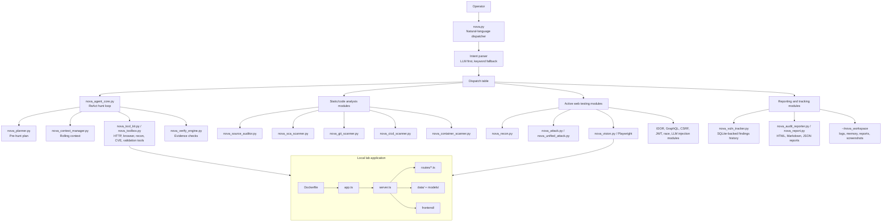
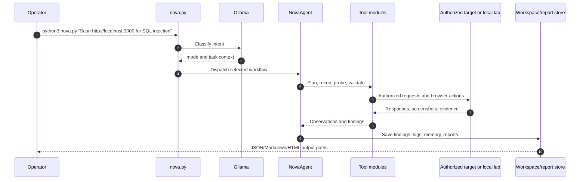
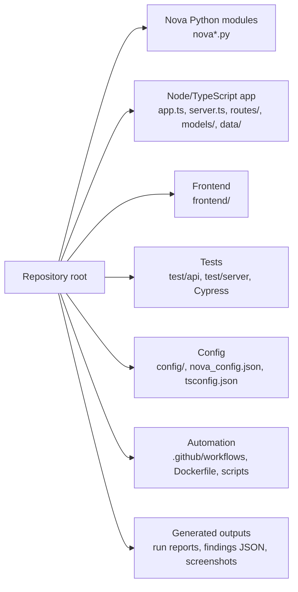
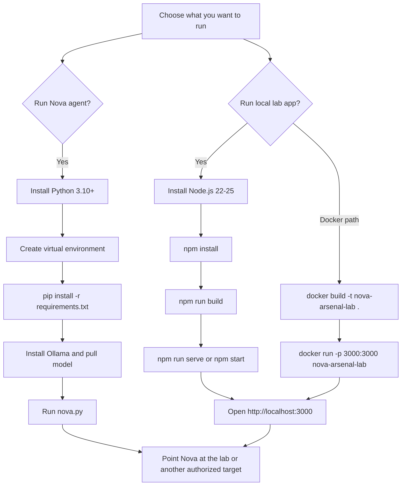
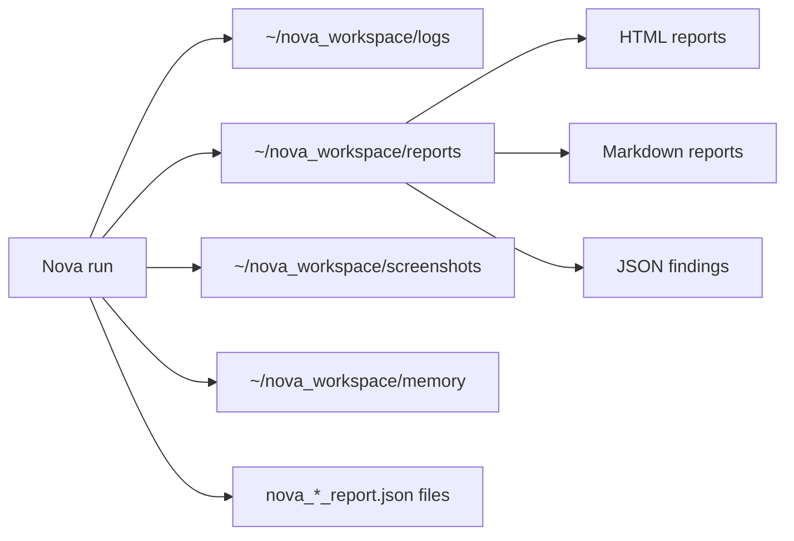

<div align="center">

# Nova Arsenal

**AI-assisted security research workspace built around a Nova Python agent and a local OWASP Juice Shop lab.**

[](https://python.org)
[](https://nodejs.org)
[](https://ollama.com)
[](Dockerfile)
[](LICENSE)

</div>

---

## Overview

Nova Arsenal combines two related surfaces:

| Surface | Main entry points | Purpose |
|---|---|---|
| **Nova security agent** | `nova.py`, `nova_agent_core.py`, `nova_tool_kit.py`, `nova_install.sh` | Natural-language security research, code review, recon, vulnerability verification, reporting, and learning workflows. |
| **Local vulnerable lab app** | `app.ts`, `server.ts`, `frontend/`, `routes/`, `Dockerfile`, `package.json` | A Node/TypeScript OWASP Juice Shop style target that can be run locally and used as a legal test bed for Nova. |

The repository also contains many supporting Nova modules, prior run outputs, JSON reports, challenge data, CI workflows, and testing assets. Use the agent only against systems where you have explicit authorization.

---

## Architecture



---

## Runtime Flow



---

## Repository Map



Important files:

| Path | Role |
|---|---|
| `nova.py` | Single-command Nova dispatcher. Parses intent and routes to specialist modules. |
| `nova_agent_core.py` | Autonomous ReAct-style loop with planning, context management, CVE research, visual recon, and verification hooks. |
| `nova_tool_kit.py`, `nova_toolbox.py` | Tool execution layer for HTTP probing, browser work, recon, research, validation, and file operations. |
| `nova_install.sh` | One-shot Nova environment installer. |
| `requirements.txt` | Python dependencies for Nova and optional security tooling. |
| `nova_config.json` | Default Nova workspace, LLM, recon, attack, reporting, and rate-limit settings. |
| `app.ts`, `server.ts` | Node/TypeScript lab application entry points. |
| `frontend/`, `routes/`, `models/`, `data/` | Web UI, API routes, persistence models, and challenge/lab data. |
| `package.json` | Node scripts for building, serving, testing, and packaging the lab app. |
| `Dockerfile` | Container build for the lab application. |

---

## Installation Decision Tree



---

## Prerequisites

| Requirement | Version | Needed for |
|---|---:|---|
| Python | 3.10+ | Nova agent modules and installer. |
| Node.js | 22-25 | TypeScript/Node lab app from `package.json`. |
| npm | Bundled with Node | Installing and running the lab app. |
| Docker | Current stable | Optional container run for the lab app. |
| Ollama | Current stable | Local LLM used by Nova. |
| Playwright Chromium | Current stable | Browser-based recon and visual analysis. |
| Go | 1.21+ | Optional external tools such as `nuclei`, `subfinder`, `httpx`, and `ffuf`. |

Optional security tools such as `nmap`, `nuclei`, `sqlmap`, `ffuf`, `subfinder`, `httpx`, `amass`, `trivy`, `semgrep`, and `bandit` expand Nova's coverage. Nova can still run with a smaller toolset, but results will be narrower.

---

## Install Nova Agent

### Option A: One-shot installer

```bash
git clone https://github.com/Informant254/Nova-arsenal.git
cd Nova-arsenal
chmod +x nova_install.sh
./nova_install.sh
```

The installer checks Python, installs `requirements.txt`, verifies optional tools, installs or starts Ollama, pulls the configured model, creates `~/nova_workspace`, writes `.env`, and syntax-checks core Nova modules.

### Option B: Manual setup

```bash
git clone https://github.com/Informant254/Nova-arsenal.git
cd Nova-arsenal

python3 -m venv ~/nova_workspace/.venv
source ~/nova_workspace/.venv/bin/activate
python -m pip install --upgrade pip
python -m pip install -r requirements.txt
playwright install chromium
```

Install and start Ollama:

```bash
curl -fsSL https://ollama.com/install.sh | sh
ollama serve
```

In a second terminal, pull a model:

```bash
ollama pull qwen3:8b
```

Create the workspace folders if you skipped the installer:

```bash
mkdir -p ~/nova_workspace/{bin,wordlists,reports,logs,screenshots,backups,tools,memory}
cp nova_config.json ~/nova_workspace/nova_config.json
```

Create `.env` in the repository root:

```env
NOVA_LLM_URL=http://localhost:11434
NOVA_LLM_MODEL=qwen3:8b
NOVA_WORKSPACE=~/nova_workspace
NOVA_MAX_STEPS=40
NOVA_TARGET=http://localhost:3000
```

---

## Install And Run The Local Lab App

### Native Node.js

```bash
git clone https://github.com/Informant254/Nova-arsenal.git
cd Nova-arsenal
npm install
npm run build
npm run serve
```

Open `http://localhost:3000`.

Useful scripts from `package.json`:

| Command | Purpose |
|---|---|
| `npm run serve` | Run TypeScript server and frontend dev server together. |
| `npm run serve:dev` | Watch-mode development run. |
| `npm run build` | Build frontend and server output. |
| `npm start` | Run built server from `build/app`. |
| `npm test` | Run frontend, server, and API tests. |
| `npm run test:e2e` | Run Cypress end-to-end tests. |
| `npm run lint` | Lint server, tests, views, and frontend. |

### Docker

```bash
docker build -t nova-arsenal-lab .
docker run --rm -p 3000:3000 nova-arsenal-lab
```

Open `http://localhost:3000`.

---

## Usage

### Verify Nova basics

```bash
source ~/nova_workspace/.venv/bin/activate
python3 nova.py "Run a health check"
```

### Scan the local lab

Start the lab first:

```bash
npm run serve
```

Then run Nova from another terminal:

```bash
source ~/nova_workspace/.venv/bin/activate
python3 nova.py "Scan http://localhost:3000 for SQL injection and XSS"
python3 nova.py "Build a threat model for ."
python3 nova.py "Scan git history for leaked secrets"
python3 nova.py "Run container security checks for this Dockerfile"
```

### Scan an authorized external target

```bash
source ~/nova_workspace/.venv/bin/activate
python3 nova.py "Run recon against https://example.com"
python3 nova.py "Check JWT, IDOR, GraphQL, and access control on https://example.com"
python3 nova.py "Create an audit report for https://example.com"
```

Only use external examples after replacing the target with a system you own or have explicit written permission to test.

---

## Configuration

Nova reads defaults from environment variables and `nova_config.json`.

| Setting | Default | Meaning |
|---|---|---|
| `NOVA_LLM_URL` | `http://localhost:11434` | Ollama API endpoint. |
| `NOVA_LLM_MODEL` | `qwen3:8b` / `auto` in config | Model used for intent and reasoning. |
| `NOVA_WORKSPACE` | `~/nova_workspace` | Reports, logs, memory, screenshots, backups, and tool cache. |
| `NOVA_MAX_STEPS` | `40` | Agent step cap for a run. |
| `NOVA_TARGET` | `http://localhost:3000` | Fallback target if a prompt does not include one. |

Example override:

```bash
NOVA_LLM_MODEL=llama3.2 NOVA_MAX_STEPS=20 python3 nova.py "Quick scan of http://localhost:3000"
```

Key `nova_config.json` sections:

| Section | Controls |
|---|---|
| `llm` | Ollama URL, model, fallback model, timeout, streaming. |
| `recon` | Subdomain, probe, URL collection tools, result limits, thread count. |
| `attack` | Enabled vulnerability classes, payload limits, redirect behavior, robots handling. |
| `tools` | On-demand tool installation and parallel installs. |
| `notifications` | Start, critical, completion, and evolution notifications. |
| `evolution` | Self-improvement toggle, test requirement, backups, forbidden files. |
| `reporting` | Output formats and report commit behavior. |
| `rate_limiting` | Request rate, host delay, and concurrency. |

---

## Output Locations



Typical report content includes verified finding title, affected target, severity, CVSS context where available, evidence, reproduction steps, impact, and remediation guidance.

---

## Testing And Quality Checks

For Nova Python files:

```bash
python3 -m py_compile nova.py nova_agent_core.py nova_tool_kit.py nova_vuln_tracker.py
```

For the Node/TypeScript lab:

```bash
npm run lint
npm test
npm run test:e2e
```

For Docker:

```bash
docker build -t nova-arsenal-lab .
docker run --rm -p 3000:3000 nova-arsenal-lab
```

---

## Troubleshooting

| Problem | Fix |
|---|---|
| `ollama` is not reachable | Run `ollama serve`, then verify with `curl http://localhost:11434/api/tags`. |
| Model not found | Run `ollama list` and `ollama pull qwen3:8b` or set `NOVA_LLM_MODEL` to an installed model. |
| Playwright browser missing | Run `playwright install chromium` inside the Nova virtual environment. |
| Python dependency conflicts | Use a clean virtual environment under `~/nova_workspace/.venv`. |
| Node install fails | Confirm Node.js is version 22-25, then retry `npm install`. |
| Lab app does not open | Check that port `3000` is free and rerun `npm run serve` or Docker with `-p 3000:3000`. |
| External tool missing | Install the tool shown in Nova's warning, then make sure it is on `PATH`. |

---

## Repository Hygiene Notes

This repository currently includes generated outputs, screenshots, run reports, virtual-environment folders, and large lab assets. That can make clones slow. For a cleaner production fork, consider moving generated findings and virtual environments outside the Git repository and keeping only source, config templates, tests, and docs under version control.

---

## Legal And Safety Notice

Nova Arsenal is for authorized security testing, education, and local lab work. Do not scan or exploit systems without explicit permission. Keep request rates reasonable, preserve evidence responsibly, and follow the rules of any bug bounty or assessment scope you operate under.

---

## License

This repository is published under the [MIT License](LICENSE).
